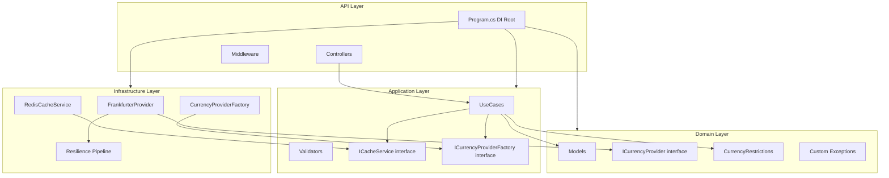
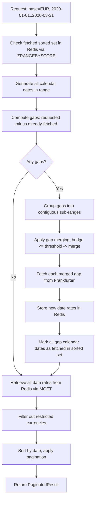

# Backend Implementation Plan -- Currency Converter Platform

This plan covers **Phases 1-4** from [DEVELOPMENT_PLAN.md](DEVELOPMENT_PLAN.md): Domain, Application, Infrastructure, API, and Testing layers.

---

## 0. Project Scaffolding

Create the solution structure with four class library projects and two test projects:

```
backend/
  CurrencyConverter.sln
  src/
    CurrencyConverter.Domain/          (.NET 8 classlib)
    CurrencyConverter.Application/     (.NET 8 classlib, refs Domain)
    CurrencyConverter.Infrastructure/  (.NET 8 classlib, refs Domain + Application)
    CurrencyConverter.API/             (.NET 8 webapi, refs all layers)
  tests/
    CurrencyConverter.UnitTests/       (xUnit, refs all src projects)
    CurrencyConverter.IntegrationTests/ (xUnit, refs API)
```

**NuGet packages by project:**

| Project | Packages |

|---|---|

| Domain | (none -- zero dependencies) |

| Application | `FluentValidation`, `FluentValidation.DependencyInjectionExtensions`, `Microsoft.Extensions.DependencyInjection.Abstractions`, `Microsoft.Extensions.Options.ConfigurationExtensions` |

| Infrastructure | `BCrypt.Net-Next`, `Microsoft.AspNetCore.Http.Abstractions`, `Microsoft.Extensions.Caching.StackExchangeRedis`, `Microsoft.Extensions.Http.Resilience`, `Microsoft.Extensions.Options.ConfigurationExtensions`, `StackExchange.Redis`, `System.IdentityModel.Tokens.Jwt` |

| API | `Asp.Versioning.Mvc`, `Asp.Versioning.Mvc.ApiExplorer`, `AspNetCore.HealthChecks.Redis`, `AspNetCore.HealthChecks.UI.Client`, `FluentValidation.AspNetCore`, `Microsoft.AspNetCore.Authentication.JwtBearer`, `RedisRateLimiting`, `Serilog.AspNetCore`, `Serilog.Enrichers.Environment`, `Serilog.Enrichers.Process`, `Serilog.Sinks.Console`, `Serilog.Sinks.File`, `Swashbuckle.AspNetCore` |

| UnitTests | `xunit`, `Moq`, `FluentAssertions`, `coverlet.collector`, `coverlet.msbuild`, `Microsoft.NET.Test.Sdk`, `xunit.runner.visualstudio` |

| IntegrationTests | `xunit`, `Microsoft.AspNetCore.Mvc.Testing`, `WireMock.Net`, `Testcontainers.Redis`, `FluentAssertions`, `coverlet.collector`, `coverlet.msbuild`, `Microsoft.NET.Test.Sdk`, `xunit.runner.visualstudio` |

---

## 1. Phase 1 -- Domain Layer

**Project:** `CurrencyConverter.Domain`

### 1.1 Models

Create under `Models/` directory:

- **`Currency`** -- `string Code`, `string Name`
- **`ExchangeRate`** -- `string BaseCurrency`, `DateTime Date`, `Dictionary<string, decimal> Rates`
- **`ConversionResult`** -- `string From`, `string To`, `decimal Amount`, `decimal Result`, `decimal Rate`, `DateTime Date`
- **`PaginatedResult<T>`** -- `IReadOnlyList<T> Items`, `int TotalCount`, `int Page`, `int PageSize`, `int TotalPages`, `bool HasNextPage`, `bool HasPreviousPage`
- **`User`** -- `Guid Id` (init), `string Username` (init), `string PasswordHash` (init), `string Role` (mutable via `ChangeRole()`), `DateTime CreatedAt` (init)
- **`Result`** / **`Result<T>`** -- functional result pattern: `bool IsSuccess`, `string? Error`, `string? ErrorCode`, `bool IsFailure`. Static factory methods: `Success()`, `Failure(error, errorCode?)`, `Success<T>(value)`, `Failure<T>(error, errorCode?)`. Used by auth and admin use cases instead of throwing exceptions for business-logic failures.

### 1.2 Provider Interface

Create `Interfaces/ICurrencyProvider.cs`:

```csharp
public interface ICurrencyProvider
{
    string ProviderName { get; }
    Task<IReadOnlyList<Currency>> GetCurrenciesAsync(CancellationToken ct);
    Task<ExchangeRate> GetLatestRatesAsync(string baseCurrency, CancellationToken ct);
    Task<ConversionResult> ConvertAsync(string from, string to, decimal amount, CancellationToken ct);
    Task<IReadOnlyList<ExchangeRate>> GetHistoricalRatesAsync(string baseCurrency, DateTime startDate, DateTime endDate, CancellationToken ct);
}
```

### 1.3 Business Rules

Create `Rules/CurrencyRestrictions.cs`:

- Static class with `FrozenSet<string>` containing: `"TRY"`, `"PLN"`, `"THB"`, `"MXN"` (with `StringComparer.OrdinalIgnoreCase`)
- Method `IsRestricted(string currencyCode)` (case-insensitive)
- Method `GetExcludedCurrencies()` -- returns `IReadOnlySet<string>`

### 1.4 Constants

Create `Constants/AppRoles.cs`:

- Static class with constants: `Admin = "Admin"`, `User = "User"`, `DefaultAdminUsername = "admin"`

### 1.5 Custom Exceptions

Create under `Exceptions/`:

- **`CurrencyNotSupportedException`** -- inherits `Exception`, carries currency code
- **`ExternalApiException`** -- inherits `Exception`, carries provider name + HTTP status code + message
- **`InvalidCredentialsException`** -- inherits `Exception`
- **`UserAlreadyExistsException`** -- inherits `Exception`, carries username

---

## 2. Phase 1 -- Application Layer

**Project:** `CurrencyConverter.Application` (references Domain)

### 2.1 Port Interfaces

Create under `Interfaces/`:

- **`ICacheService`** with methods:
  - `GetAsync<T>(string key, CancellationToken ct)`
  - `SetAsync<T>(string key, T value, TimeSpan? ttl, CancellationToken ct)`
  - `GetCachedDatesAsync(string baseCurrency, DateTime start, DateTime end, CancellationToken ct)` -- returns `IReadOnlySet<DateTime>`
  - `StoreDateRatesAsync(string baseCurrency, DateTime date, Dictionary<string, decimal> rates, CancellationToken ct)`
  - `MarkDatesAsFetchedAsync(string baseCurrency, IEnumerable<DateTime> dates, CancellationToken ct)`
  - `GetDateRatesBatchAsync(string baseCurrency, IEnumerable<DateTime> dates, CancellationToken ct)` -- returns `Dictionary<DateTime, Dictionary<string, decimal>>`

- **`ICurrencyProviderFactory`** with method:
  - `GetProvider(string? providerName = null)` -- returns `ICurrencyProvider`

- **`IUserRepository`** -- pure CRUD operations on `Domain.Models.User`:
  - `GetByUsername(string)`, `GetById(Guid)`, `GetAll()`
  - `Create(string username, string passwordHash, string role)` -- creates user
  - `TryCreate(string username, string passwordHash, string role)` -- returns `(bool Created, User User)` tuple for atomic check-and-create
  - `UpdateRole(Guid id, string role)`, `Delete(Guid id)`

- **`IJwtTokenService`** -- `string GenerateToken(User user)`

- **`IPasswordHasher`** -- `string Hash(string password)`, `bool Verify(string password, string hash)`

### 2.2 DTOs / Query Objects

Create under `DTOs/`:

- **Queries:** `GetCurrenciesQuery` (empty -- no params), `GetLatestRatesQuery` (`string BaseCurrency`), `ConvertCurrencyQuery` (`string From`, `string To`, `decimal Amount`), `GetHistoricalRatesQuery` (`string BaseCurrency`, `DateTime StartDate`, `DateTime EndDate`, `int Page = 1`, `int PageSize = 10`, `int TimezoneOffset = 0`)
- **Auth commands:** `LoginCommand(string Username, string Password)`, `RegisterCommand(string Username, string Password)`, `CreateUserCommand(string Username, string Password, string Role)`, `ChangeRoleCommand(Guid UserId, string NewRole)`, `DeleteUserCommand(Guid TargetUserId, Guid CurrentUserId)`
- **Response DTOs:** `CurrencyDto` (Code, Name, IsRestricted), `LatestRatesDto`, `ConversionResultDto`, `HistoricalRatesDto`, `AuthResult(string Token, string Username, string Role)`, `UserDto(Guid Id, string Username, string Role, DateTime CreatedAt)`

### 2.3 Settings

Create under `Settings/`:

- **`JwtSettings`** -- `Secret`, `Issuer`, `Audience`, `ExpirationMinutes` (with `SectionName = "JwtSettings"`)
- **`CacheSettings`** -- `LatestRatesTtlMinutes` (default 30), `CurrenciesTtlMinutes` (default 60), `GapMergeThresholdDays` (default 5) (with `SectionName = "CacheSettings"`)
- **`CurrencyProviderSettings`** -- `DefaultProvider` (default `"Frankfurter"`) (with `SectionName = "CurrencyProvider"`)

### 2.4 FluentValidation Validators

Create under `Validators/`:

- **`GetLatestRatesQueryValidator`** -- BaseCurrency: not empty, 3 chars, not in restricted set
- **`ConvertCurrencyQueryValidator`** -- From/To: not empty, 3 chars, not restricted; Amount > 0
- **`GetHistoricalRatesQueryValidator`** -- BaseCurrency validated; StartDate <= EndDate; max span 730 days; EndDate <= today (adjusted by TimezoneOffset); Page >= 1; PageSize 1..100
- **`LoginCommandValidator`** -- username/password not empty
- **`RegisterCommandValidator`** -- username not empty (max 50), password min 6 / max 128
- **`CreateUserCommandValidator`** -- username not empty (max 50), password min 6 / max 128, role must be AppRoles.Admin or AppRoles.User

### 2.5 Use Cases

Create under `UseCases/`:

**Currency use cases (async):**

1. **`GetCurrenciesUseCase`**

   - Inject `ICurrencyProviderFactory`, `ICacheService`
   - Cache key: `currencies:list`, TTL from `CacheSettings.CurrenciesTtlMinutes`
   - Return list with each currency marked `IsRestricted` based on `CurrencyRestrictions`

2. **`GetLatestRatesUseCase`**

   - Validate base currency is not restricted (throw `CurrencyNotSupportedException`)
   - Check cache `rates:latest:{base}`, TTL from `CacheSettings.LatestRatesTtlMinutes`
   - On miss: call provider, **filter out restricted currencies from rates dictionary**, cache, return

3. **`ConvertCurrencyUseCase`**

   - Validate both from AND to are not restricted
   - Delegate to provider `ConvertAsync`
   - Return mapped `ConversionResultDto`

4. **`GetHistoricalRatesUseCase`** (most complex)

   - Inject `ICurrencyProviderFactory`, `ICacheService`, `IOptions<CacheSettings>`, `TimeProvider`
   - Validate base currency is not restricted
   - Determine "today" using `TimeProvider` adjusted by `TimezoneOffset`
   - Call `ICacheService.GetCachedDatesAsync()` to get fetched dates in range
   - Generate all calendar dates in [start, end] via internal `GenerateAllDates` helper
   - Compute gaps = requested dates minus fetched dates
   - Group gaps into contiguous sub-ranges via `GroupIntoContiguousRanges`
   - **Apply gap merging** via `MergeGaps`: if bridge between two gaps <= `GapMergeThresholdDays`, merge into single request
   - If range includes today: always include today in gaps (exclude from fetched set)
   - Fetch each gap from provider
   - Store new date rates + mark all calendar dates in gap as fetched (incl. weekends with no data)
   - **Filter out restricted currencies** from each date's rate dictionary
   - Retrieve full range from cache via `GetDateRatesBatchAsync`
   - Sort by date, apply pagination (Skip/Take), return `PaginatedResult<ExchangeRate>`

**Auth use cases:**

5. **`LoginUseCase`** (async `ExecuteAsync`)

   - Inject `IUserRepository`, `IPasswordHasher`, `IJwtTokenService`
   - Lookup user by username; return `Result.Failure<AuthResult>("Invalid username or password.", "INVALID_CREDENTIALS")` if not found
   - Verify password (wrapped in `Task.Run` for BCrypt CPU work); return Failure on mismatch
   - Generate JWT token; return `Result.Success(new AuthResult(token, username, role))`

6. **`RegisterUseCase`** (async `ExecuteAsync`)

   - Inject `IUserRepository`, `IPasswordHasher`, `IJwtTokenService`
   - Hash password (wrapped in `Task.Run`), call `TryCreate` with default `AppRoles.User` role
   - Return `Result.Failure` with `USER_ALREADY_EXISTS` if username taken
   - Generate JWT token; return `Result.Success(new AuthResult(...))`

7. **`CreateUserUseCase`** (sync `Execute`)

   - Inject `IUserRepository`, `IPasswordHasher`
   - Validate role against `AppRoles.Admin` / `AppRoles.User`; return `Result.Failure` with `INVALID_ROLE` if invalid
   - Hash password, call `TryCreate` with specified role
   - Return `Result.Failure` with `USER_ALREADY_EXISTS` if username taken
   - Return `Result.Success(new UserDto(...))`

8. **`GetAllUsersUseCase`** (sync `Execute`) -- returns `IReadOnlyList<UserDto>`

9. **`GetUserByIdUseCase`** (sync `Execute(Guid id)`) -- returns `UserDto?`

10. **`UpdateUserRoleUseCase`** (sync `Execute`)

    - Validate role against `AppRoles`; return Failure with `INVALID_ROLE` if invalid
    - Lookup user; return Failure with `NOT_FOUND` if missing
    - Prevent changing default admin role; return Failure with `DEFAULT_ADMIN`
    - Call `UpdateRole`, return `Result.Success(new UserDto(...))`

11. **`DeleteUserUseCase`** (sync `Execute`)

    - Prevent self-deletion; return Failure with `SELF_DELETE`
    - Lookup user; return Failure with `NOT_FOUND` if missing
    - Prevent deleting default admin account; return Failure with `DEFAULT_ADMIN`
    - Call `Delete`, return `Result.Success()`

### 2.6 DI Registration

Create `DependencyInjection.cs` in Application with `AddApplication(this IServiceCollection)` extension method registering:

- All eleven use cases as scoped services
- All FluentValidation validators via `AddValidatorsFromAssembly`
- `InternalsVisibleTo` for `CurrencyConverter.UnitTests` in `.csproj` (for testing internal Result constructors)

---

## 3. Phase 2 -- Infrastructure Layer

**Project:** `CurrencyConverter.Infrastructure` (references Domain + Application)

### 3.1 Frankfurter Provider

Create under `Providers/Frankfurter/`:

- **`FrankfurterOptions`** -- `BaseUrl` (default `https://api.frankfurter.dev`), `TimeoutSeconds` (with `SectionName = "Frankfurter"`)
- **Internal DTOs** under `Providers/Frankfurter/DTOs/` (must not leak outside Infrastructure):
  - `FrankfurterLatestResponse` -- `decimal Amount`, `string Base`, `DateTime Date`, `Dictionary<string, decimal> Rates`
  - `FrankfurterTimeSeriesResponse` -- `decimal Amount`, `string Base`, `DateTime StartDate`, `DateTime EndDate`, `Dictionary<string, Dictionary<string, decimal>> Rates` (Rates keyed by date string)
  - Note: Currencies response deserialized directly as `Dictionary<string, string>` (no dedicated DTO)
- **`FrankfurterProvider : ICurrencyProvider`**
  - `ProviderName = "Frankfurter"`
  - Inject typed `HttpClient`
  - URL construction (all prefixed with `/v1/`): `/v1/currencies`, `/v1/latest?base={base}`, `/v1/latest?from={from}&to={to}&amount={amount}`, `/v1/{start:yyyy-MM-dd}..{end:yyyy-MM-dd}?base={base}`
  - Map internal DTOs to Domain models inside provider
  - Private `EnsureSuccessResponse` method reads response body and throws `ExternalApiException` on non-success status codes

### 3.2 Currency Provider Factory

Create `Providers/CurrencyProviderFactory.cs`:

- Accept `IEnumerable<ICurrencyProvider>` via DI
- Build `Dictionary<string, ICurrencyProvider>` by `ProviderName`
- `GetProvider(name)`: resolve by name or return default from config (`DefaultProvider` setting)

### 3.3 Redis Cache Service

Create `Caching/RedisCacheService.cs` implementing `ICacheService`:

- Inject `IDistributedCache`, `IConnectionMultiplexer`, `ILogger<RedisCacheService>`, `TimeProvider`
- **Simple key-value** (`GetAsync<T>` / `SetAsync<T>`): use `IDistributedCache`, serialize with `System.Text.Json` (camelCase naming policy)
- **Historical range-aware operations**: use `IConnectionMultiplexer.GetDatabase()` directly for Sorted Set commands
  - `GetCachedDatesAsync`: `SortedSetRangeByScoreAsync` on `rates:historical:fetched:{base}` with score range
  - `StoreDateRatesAsync`: `StringSetAsync` on `rates:historical:{base}:{yyyy-MM-dd}` (no TTL -- immutable)
  - `MarkDatesAsFetchedAsync`: `SortedSetAddAsync` on `rates:historical:fetched:{base}` with score = `yyyyMMdd`
  - `GetDateRatesBatchAsync`: Redis `CreateBatch()` + `StringGetAsync` for each date key, then `Task.WhenAll`
- **Today exclusion**: in `MarkDatesAsFetchedAsync`, filter out today's date (from `TimeProvider`) before adding to sorted set
- **Graceful fallback**: wrap all Redis operations in try-catch; on failure, log and return empty/null (never throw)
- **Error escalation**: track `_consecutiveErrors` (volatile int with `Interlocked`); below threshold (5) log Warning, at/above threshold log Error with degradation notice. Reset on success via `OnSuccess()`/`OnError()` helper methods
- **Note**: No distributed lock for thundering herd in current implementation

### 3.5 Resilience Pipeline

Configure in DI registration for `FrankfurterProvider`'s typed `HttpClient`:

- Use `AddResilienceHandler("frankfurter-pipeline")` with custom pipeline:

  1. **Total request timeout**: 45 seconds
  2. **Retry**: 3 attempts, exponential backoff with jitter (~200ms, ~400ms, ~800ms)
  3. **Circuit breaker**: open after 5 failures in 30s window, break duration 30s
  4. **Attempt timeout**: 10s per attempt

### 3.6 Correlation ID DelegatingHandler

Create `Http/CorrelationIdDelegatingHandler.cs`:

- Read correlation ID from `IHttpContextAccessor` / `HttpContext.Items`
- Attach `X-Correlation-ID` header to outgoing Frankfurter HTTP requests

### 3.7 Auth Implementations

Create under `Auth/`:

- **`JwtTokenService`** -- implements `IJwtTokenService`, injects `IOptions<JwtSettings>` + `TimeProvider`. Generates JWT with claims: `sub` (user ID), `ClaimTypes.Name` (username), `ClaimTypes.Role` (role -- uses .NET `ClaimTypes` for `[Authorize(Roles)]` compatibility), `client_id` (user ID), `jti` (unique GUID). Uses `TimeProvider` for expiration calculation.
- **`BCryptPasswordHasher`** -- implements `IPasswordHasher`, uses `BCrypt.Net-Next` for hashing and verification
- **`InMemoryUserRepository`** -- implements `IUserRepository`, uses `ConcurrentDictionary<Guid, User>`. Injects `IPasswordHasher` + `TimeProvider`. Pre-seeds admin user (`admin`/`admin123`, `AppRoles.Admin`) on construction. Uses `lock` object in `TryCreate` for atomic check-and-create (prevents race conditions on concurrent registration of same username).

### 3.8 DI Registration

Create `DependencyInjection.cs` in Infrastructure with `AddInfrastructure(this IServiceCollection, IConfiguration)`:

- Bind `FrankfurterOptions`, `CacheSettings`, `CurrencyProviderSettings` from configuration
- Register `CorrelationIdDelegatingHandler` as Transient
- Register typed `HttpClient` for `ICurrencyProvider`/`FrankfurterProvider` with base URL from `FrankfurterOptions`, timeout, and `CorrelationIdDelegatingHandler`, with `AddResilienceHandler()` pipeline attached
- Register `CurrencyProviderFactory` as `ICurrencyProviderFactory` (Transient)
- Register `IConnectionMultiplexer` as Singleton (with `AbortOnConnectFail = false`)
- `AddStackExchangeRedisCache` with instance name `CurrencyConverter:`
- Register `RedisCacheService` as `ICacheService` (Singleton)
- Register `BCryptPasswordHasher` as `IPasswordHasher` (Singleton)
- Register `JwtTokenService` as `IJwtTokenService` (Singleton)

Separate `AddInMemoryUserRepository()` extension method registers `InMemoryUserRepository` as `IUserRepository` (Singleton)

---

## 4. Phase 3 -- API Layer

**Project:** `CurrencyConverter.API` (references all layers)

### 4.1 Program.cs / Composition Root

Configure in order:

1. Serilog bootstrap (with `ProcessId`, `MachineName`, `EnvironmentName` enrichers)
2. Configure settings: `JwtSettings`, `CorsSettings`, `RateLimitingSettings`
3. Register `TimeProvider.System` and `HttpContextAccessor`
4. `builder.Services.AddApplication()` and `builder.Services.AddInfrastructure(config)`
5. `builder.Services.AddInMemoryUserRepository()`
6. JWT Bearer authentication (`AddJwtAuthentication`)
7. API versioning (`Asp.Versioning.Mvc` + `ApiExplorer`)
8. Rate limiting (`AddRedisRateLimiting`)
9. CORS policy (`AddCorsPolicy`)
10. Health checks (`AddApiHealthChecks`)
11. Swagger/OpenAPI (`AddSwaggerDocumentation`)
12. Controllers + JSON options (camelCase)
13. ForwardedHeaders configuration
14. Optional `PORT` env var for container deployment

Middleware pipeline (defined in `WebApplicationExtensions.UseMiddlewarePipeline()`):

1. `UseForwardedHeaders`
2. `UseSerilogRequestLogging` (with `ClientIP` and `ClientId` enrichment)
3. `CorrelationIdMiddleware`
4. `GlobalExceptionHandlingMiddleware`
5. `UseSwagger` + `UseSwaggerUI`
6. `UseCors`
7. `UseAuthentication` + `UseAuthorization`
8. `UseRateLimiter`
9. `MapControllers().RequireRateLimiting("authenticated")`
10. `MapHealthChecks` — `/health/live` (no external deps, `DisableRateLimiting`) + `/health/ready` (Redis + Frankfurter, `UIResponseWriter`, `DisableRateLimiting`)

### 4.2 Controllers (all under `/api/v1/`, all use `[ApiVersion("1.0")]`, `[ApiController]`, `[Produces("application/json")]`)

- **`AuthController`** (`/api/v1/auth`, `[AllowAnonymous]`)
  - `POST /login` -- validates via `LoginCommandValidator`, calls `LoginUseCase`, maps `Result` to 200 `ApiResponse<AuthResult>` or 401 `ErrorResponse`
  - `POST /register` -- validates via `RegisterCommandValidator`, calls `RegisterUseCase`, maps `Result` to 201 `ApiResponse<AuthResult>` or 409 `ErrorResponse`

- **`CurrenciesController`** (`/api/v1/currencies`, `[Authorize]`)
  - `GET /` -- calls `GetCurrenciesUseCase`, returns list with `isRestricted` flag

- **`RatesController`** (`/api/v1/rates`, `[Authorize]`)
  - `GET /latest?base=EUR` -- calls `GetLatestRatesUseCase`
  - `GET /historical?base=EUR&from=...&to=...&page=1&pageSize=10&timezoneOffset=0` -- calls `GetHistoricalRatesUseCase`

- **`ConversionController`** (`/api/v1/convert`, `[Authorize]`)
  - `GET /?from=EUR&to=USD&amount=100` -- calls `ConvertCurrencyUseCase`

- **`UserManagementController`** (`/api/v1/admin/users`, `[Authorize(Roles = AppRoles.Admin)]`)
  - `GET /` -- list all users
  - `GET /{id:guid}` -- get user by id
  - `POST /` -- create new user (body: `CreateUserRequest`), validates via `CreateUserCommandValidator`, calls `CreateUserUseCase`, maps `Result` to 201/400/409
  - `PUT /{id:guid}/role` -- change role (body: `ChangeRoleRequest`), calls `UpdateUserRoleUseCase`, maps `Result` to 200/400/404
  - `DELETE /{id:guid}` -- delete user, extracts current user ID from `ClaimTypes.NameIdentifier`, calls `DeleteUserUseCase`, maps `Result` to 204/400/404

Success responses use `ApiResponse<T>` envelope: `{ data, metadata }`.
Error responses use `ErrorResponse` format: `{ type, title, status, detail, errors }`.
API request models in `Models/AuthModels.cs`: `CreateUserRequest(Username, Password, Role)`, `ChangeRoleRequest(Role)`.

### 4.3 JWT Authentication

- Configure via `AddJwtAuthentication()` extension method in `ServiceCollectionExtensions`
- Security check: throws `InvalidOperationException` on startup if JWT secret is empty/whitespace or equals `DefaultJwtSecret` constant
- JWT settings from `appsettings.json` section `JwtSettings`: `Secret`, `Issuer`, `Audience`, `ExpirationMinutes`
- Token validation: validate issuer, audience, lifetime, signing key; `ClockSkew = TimeSpan.Zero`
- Token contains claims: `sub` (user ID), `ClaimTypes.Name`, `ClaimTypes.Role`, `client_id`, `jti`
- Auth implementations live in Infrastructure/Auth/ (JwtTokenService, BCryptPasswordHasher, InMemoryUserRepository)

### 4.4 Rate Limiting (Redis-backed)

- Use `RedisRateLimiting` NuGet package
- Fixed window: 120 requests/minute per `client_id` from JWT claims
- Config from `appsettings.json` section `RateLimiting:RequestsPerMinute`
- Return `429` with `Retry-After` header
- Graceful fallback to in-memory if Redis unavailable (log warning)
- Health check and auth endpoints excluded from rate limiting

### 4.5 Middleware

Create under `Middleware/`:

1. **`CorrelationIdMiddleware`**

   - Read `X-Correlation-ID` from request headers or generate new `Guid`
   - Store in `HttpContext.Items["CorrelationId"]` and push to Serilog `LogContext`
   - Set response header `X-Correlation-ID`

2. **`GlobalExceptionHandlingMiddleware`**

   - `InvalidCredentialsException` -> 401
   - `UserAlreadyExistsException` -> 409
   - `CurrencyNotSupportedException` -> 400
   - `ValidationException` (FluentValidation) -> 400 with field-level errors
   - `ExternalApiException` -> 502
   - `BrokenCircuitException` / `TimeoutRejectedException` -> 503
   - Unhandled -> 500 (no stack trace in Prod)
   - Response format: `ErrorResponse { type, title, status, detail, errors }` with RFC 7231 problem type URLs
   - Log every exception with correlation ID

**Request Logging:** Uses Serilog's built-in `UseSerilogRequestLogging()` (not a custom middleware) with `EnrichDiagnosticContext` delegate:
   - `ClientIP` from `HttpContext.Connection.RemoteIpAddress`
   - `ClientId` from JWT `client_id` claim (defaults to `"anonymous"`)

### 4.6 Structured Logging (Serilog)

- Bootstrap in `Program.cs` with `CreateBootstrapLogger()` + `UseSerilog()` with `ReadFrom.Configuration`
- Sinks: Console (Dev + Bootstrap), File with JSON (Prod)
- Enrichers: `FromLogContext`, `MachineName`, `EnvironmentName`, `ProcessId`
- Configure via `appsettings.json` Serilog section per environment

### 4.7 API Versioning

- URL-based: `/api/v1/...`
- Use `Asp.Versioning.Mvc` + `Asp.Versioning.Mvc.ApiExplorer`
- Default version 1.0
- Configure Swagger to show versioned endpoints

### 4.8 Health Checks

- **Liveness**: `GET /health/live` -- basic process check (no external deps)
- **Readiness**: `GET /health/ready` -- Redis (`AddRedis()`) + Frankfurter (custom health check: lightweight `GET /currencies` with short timeout)
- Anonymous access (no JWT), excluded from rate limiting
- Use `AspNetCore.HealthChecks.UI.Client` for JSON response in Dev

### 4.9 CORS

- Dev: allow `http://localhost:5173`
- Prod: configurable via `appsettings.json` section `CorsSettings:AllowedOrigins`

### 4.10 Multi-Environment Configuration

Create four config files:

- `appsettings.json` -- shared defaults (Frankfurter options, cache settings, JWT issuer/audience/expiration, rate limiting 120/min, CORS, Redis connection string, Serilog)
- `appsettings.Development.json` -- verbose logging, JWT secret (development-only), local Redis `localhost:6379`, `http://localhost:5173` CORS origin
- `appsettings.Testing.json` -- WireMock base URL, overridden JWT settings, test Redis
- `appsettings.Production.json` -- strict rate limits (60/min), minimal Serilog logging (Warning level), File sink. JWT secret loaded from environment variables (not in config file)

---

## 5. Phase 4 -- Testing

### 5.1 Unit Tests (`CurrencyConverter.UnitTests`)

Organized by layer in directories: `Domain/`, `Application/`, `Infrastructure/`, `Middleware/`, `API/`, `UseCases/`, `Validators/`

**Domain tests:**

- `CurrencyRestrictionsTests` -- all 4 blocked, valid pass, case-insensitive check
- `ModelsTests` -- model construction, properties, Result pattern
- `ExceptionTests` -- custom exception construction and properties

**Application use case tests** (bulk of tests, mock dependencies):

- `GetCurrenciesUseCaseTests` -- cache hit/miss, restricted marking
- `GetLatestRatesUseCaseTests` -- cache hit returns cached; cache miss calls provider then caches; restricted base throws; restricted currencies filtered from rates
- `ConvertCurrencyUseCaseTests` -- happy path; restricted source/target throws; amount validated
- `GetHistoricalRatesUseCaseTests` -- pagination math; empty results; gap detection (partial cache); today re-fetch; merge cached + fresh; gap merging with threshold
- `LoginUseCaseTests` -- valid credentials return Result.Success; unknown user returns Failure; wrong password returns Failure
- `RegisterUseCaseTests` -- successful registration returns Result.Success; existing username returns Failure
- `GetAllUsersUseCaseTests` -- returns all users mapped to DTOs
- `GetUserByIdUseCaseTests` -- returns user when found; returns null when not found
- `UpdateUserRoleUseCaseTests` -- valid role update; invalid role; unknown user; default admin protection
- `DeleteUserUseCaseTests` -- successful deletion; self-deletion prevented; unknown user; default admin protection
- `DtoTests` -- DTO construction verification

**Validator tests:**

- `GetLatestRatesQueryValidatorTests`, `ConvertCurrencyQueryValidatorTests`, `GetHistoricalRatesQueryValidatorTests` -- boundary values, missing fields, invalid formats, timezone offset

**Infrastructure tests** (mock HttpClient / Redis):

- `FrankfurterProviderTests` + `FrankfurterProviderAdditionalTests` -- correct URL construction (`/v1/{start}..{end}`); response mapping; HTTP error handling
- `CurrencyProviderFactoryTests` -- resolves known; throws for unknown; default fallback
- `RedisCacheServiceTests` + `RedisCacheServiceAdditionalTests` -- serialization roundtrip; TTL; graceful fallback; gap detection (fully cached, partial, empty); fetched set marks weekends; batch GET subset; today excluded from fetched set; error escalation
- `JwtTokenServiceTests` -- generates valid JWT; correct claims; correct expiration
- `BCryptPasswordHasherTests` -- hash non-empty; verify correct/wrong password; unique salts
- `InMemoryUserRepositoryTests` -- pre-seeded admin; CRUD; TryCreate atomicity; case-insensitive lookup
- `CorrelationIdDelegatingHandlerTests` -- attaches header to outgoing requests

**API tests:**

- `AuthControllerTests`, `CurrenciesControllerTests`, `RatesControllerTests`, `ConversionControllerTests`, `UserManagementControllerTests` -- thin wrapper verification, Result-to-HTTP mapping
- `ApiResponseTests` -- response envelope construction, ErrorResponse factory methods
- `ConfigurationTests` -- DI configuration validation
- `FrankfurterHealthCheckTests` -- health check behavior

**Middleware tests:**

- `CorrelationIdMiddlewareTests` -- correlation ID generation/propagation
- `GlobalExceptionHandlingMiddlewareTests` + `GlobalExceptionHandlingMiddlewareAdditionalTests` -- exception-to-status-code mapping (InvalidCredentials→401, UserAlreadyExists→409, CurrencyNotSupported→400, ValidationException→400, ExternalApi→502, BrokenCircuit/Timeout→503)

### 5.2 Integration Tests (`CurrencyConverter.IntegrationTests`)

- `WebApplicationFactory<Program>` for in-process API
- **WireMock.Net** mocking Frankfurter responses
- **Testcontainers** for real Redis instance per test run

**Test scenarios:**

1. Full happy path: register -> login -> get rates -> convert -> get historical with pagination
2. Excluded currency -> 400
3. Frankfurter down (WireMock 500) -> circuit breaker -> 503
4. No JWT -> 401
5. Rate limiting -> 429 after N requests
6. Pagination metadata correctness (totalCount, totalPages, hasNext)
7. Currencies endpoint: full list with restricted marked
8. Health check `/health/ready` -- healthy when all deps up
9. Health check `/health/ready` -- unhealthy when Redis down
10. Admin CRUD: list/update/delete users; User role -> 403 on admin endpoints
11. Register creates user and returns valid JWT

### 5.3 Coverage

- Coverlet for collection during `dotnet test --collect:"XPlat Code Coverage"`
- ReportGenerator for HTML/Cobertura output
- Target: >= 90% line coverage

---

## Dependency Flow Diagram



## Historical Rates Caching Flow

