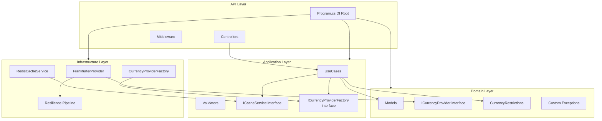
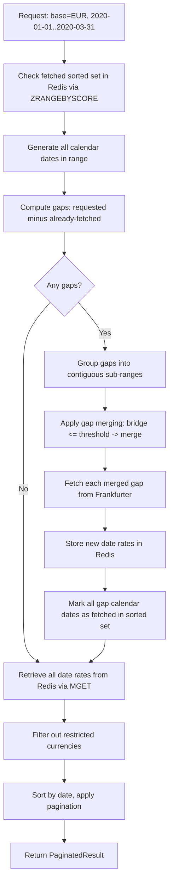

# Backend Implementation Plan -- Currency Converter Platform

This plan covers **Phases 1-4** from [DEVELOPMENT_PLAN.md](DEVELOPMENT_PLAN.md): Domain, Application, Infrastructure, API, and Testing layers.

---

## 0. Project Scaffolding

Create the solution structure with four class library projects and two test projects:

```
backend/
  CurrencyConverter.sln
  src/
    CurrencyConverter.Domain/          (.NET 8 classlib)
    CurrencyConverter.Application/     (.NET 8 classlib, refs Domain)
    CurrencyConverter.Infrastructure/  (.NET 8 classlib, refs Domain + Application)
    CurrencyConverter.API/             (.NET 8 webapi, refs all layers)
  tests/
    CurrencyConverter.UnitTests/       (xUnit, refs all src projects)
    CurrencyConverter.IntegrationTests/ (xUnit, refs API)
```

**NuGet packages by project:**

| Project | Packages |

|---|---|

| Domain | (none -- zero dependencies) |

| Application | `FluentValidation`, `Microsoft.Extensions.DependencyInjection.Abstractions` |

| Infrastructure | `StackExchange.Redis`, `Microsoft.Extensions.Caching.StackExchangeRedis`, `Microsoft.Extensions.Http.Resilience`, `System.Text.Json` |

| API | `Serilog.AspNetCore`, `Serilog.Sinks.Console`, `Serilog.Sinks.File`, `Serilog.Enrichers.Environment`, `Serilog.Enrichers.Process`, `Asp.Versioning.Mvc`, `Asp.Versioning.Mvc.ApiExplorer`, `Swashbuckle.AspNetCore`, `Microsoft.AspNetCore.Authentication.JwtBearer`, `RedisRateLimiting`, `AspNetCore.HealthChecks.Redis`, `AspNetCore.HealthChecks.UI.Client`, `FluentValidation.AspNetCore` |

| UnitTests | `xUnit`, `Moq`, `FluentAssertions`, `Coverlet.msbuild`, `Microsoft.NET.Test.Sdk` |

| IntegrationTests | `xUnit`, `Microsoft.AspNetCore.Mvc.Testing`, `WireMock.Net`, `Testcontainers.Redis`, `FluentAssertions`, `Coverlet.msbuild`, `Microsoft.NET.Test.Sdk` |

---

## 1. Phase 1 -- Domain Layer

**Project:** `CurrencyConverter.Domain`

### 1.1 Models

Create under `Models/` directory:

- **`Currency`** -- `string Code`, `string Name`
- **`ExchangeRate`** -- `string BaseCurrency`, `DateTime Date`, `Dictionary<string, decimal> Rates`
- **`ConversionResult`** -- `string From`, `string To`, `decimal Amount`, `decimal Result`, `decimal Rate`, `DateTime Date`
- **`PaginatedResult<T>`** -- `IReadOnlyList<T> Items`, `int TotalCount`, `int Page`, `int PageSize`, `int TotalPages`, `bool HasNextPage`, `bool HasPreviousPage`

### 1.2 Provider Interface

Create `Interfaces/ICurrencyProvider.cs`:

```csharp
public interface ICurrencyProvider
{
    string ProviderName { get; }
    Task<IReadOnlyList<Currency>> GetCurrenciesAsync(CancellationToken ct);
    Task<ExchangeRate> GetLatestRatesAsync(string baseCurrency, CancellationToken ct);
    Task<ConversionResult> ConvertAsync(string from, string to, decimal amount, CancellationToken ct);
    Task<IReadOnlyList<ExchangeRate>> GetHistoricalRatesAsync(string baseCurrency, DateTime startDate, DateTime endDate, CancellationToken ct);
}
```

### 1.3 Business Rules

Create `Rules/CurrencyRestrictions.cs`:

- Static class with `FrozenSet<string>` containing: `"TRY"`, `"PLN"`, `"THB"`, `"MXN"`
- Method `IsRestricted(string currencyCode)` (case-insensitive)

### 1.4 Custom Exceptions

Create under `Exceptions/`:

- **`CurrencyNotSupportedException`** -- inherits `Exception`, carries currency code
- **`ExternalApiException`** -- inherits `Exception`, carries provider name + HTTP status code + message

---

## 2. Phase 1 -- Application Layer

**Project:** `CurrencyConverter.Application` (references Domain)

### 2.1 Port Interfaces

Create under `Interfaces/`:

- **`ICacheService`** with methods:
  - `GetAsync<T>(string key, CancellationToken ct)`
  - `SetAsync<T>(string key, T value, TimeSpan? ttl, CancellationToken ct)`
  - `GetCachedDatesAsync(string baseCurrency, DateTime start, DateTime end, CancellationToken ct)` -- returns `IReadOnlySet<DateTime>`
  - `StoreDateRatesAsync(string baseCurrency, DateTime date, Dictionary<string, decimal> rates, CancellationToken ct)`
  - `MarkDatesAsFetchedAsync(string baseCurrency, IEnumerable<DateTime> dates, CancellationToken ct)`
  - `GetDateRatesBatchAsync(string baseCurrency, IEnumerable<DateTime> dates, CancellationToken ct)` -- returns `Dictionary<DateTime, Dictionary<string, decimal>>`

- **`ICurrencyProviderFactory`** with method:
  - `GetProvider(string? providerName = null)` -- returns `ICurrencyProvider`

### 2.2 DTOs / Query Objects

Create under `DTOs/`:

- `GetCurrenciesQuery` (empty -- no params)
- `GetLatestRatesQuery` -- `string BaseCurrency`
- `ConvertCurrencyQuery` -- `string From`, `string To`, `decimal Amount`
- `GetHistoricalRatesQuery` -- `string BaseCurrency`, `DateTime StartDate`, `DateTime EndDate`, `int Page`, `int PageSize`
- Response DTOs: `CurrencyDto` (Code, Name, IsRestricted), `LatestRatesDto`, `ConversionResultDto`, `HistoricalRatesDto`

### 2.3 FluentValidation Validators

Create under `Validators/`:

- **`GetLatestRatesQueryValidator`** -- BaseCurrency: not empty, 3 chars, not in restricted set
- **`ConvertCurrencyQueryValidator`** -- From/To: not empty, 3 chars, not restricted; Amount > 0
- **`GetHistoricalRatesQueryValidator`** -- BaseCurrency validated; StartDate <= EndDate; max span 730 days; EndDate <= today; Page >= 1; PageSize 1..100

### 2.4 Use Cases

Create under `UseCases/`:

1. **`GetCurrenciesUseCase`**

   - Inject `ICurrencyProviderFactory`, `ICacheService`
   - Cache key: `currencies:list`, TTL 60 min
   - Return list with each currency marked `IsRestricted` based on `CurrencyRestrictions`

2. **`GetLatestRatesUseCase`**

   - Validate base currency is not restricted (throw `CurrencyNotSupportedException`)
   - Check cache `rates:latest:{base}`, TTL 30 min
   - On miss: call provider, **filter out restricted currencies from rates dictionary**, cache, return

3. **`ConvertCurrencyUseCase`**

   - Validate both from AND to are not restricted
   - Delegate to provider `ConvertAsync`
   - Return mapped `ConversionResultDto`

4. **`GetHistoricalRatesUseCase`** (most complex)

   - Validate base currency is not restricted
   - Call `ICacheService.GetCachedDatesAsync()` to get fetched dates in range
   - Generate all calendar dates in [start, end]
   - Compute gaps = requested dates minus fetched dates
   - Group gaps into contiguous sub-ranges
   - **Apply gap merging**: if bridge between two gaps <= `GapMergeThresholdDays` (from config, default 5), merge into single request
   - If range includes today: always include today in gaps (exclude from fetched set)
   - Fetch each gap from provider
   - Store new date rates + mark all calendar dates in gap as fetched (incl. weekends with no data)
   - **Filter out restricted currencies** from each date's rate dictionary
   - Retrieve full range from cache via `GetDateRatesBatchAsync`
   - Sort by date, apply pagination (Skip/Take), return `PaginatedResult<ExchangeRate>`

### 2.5 DI Registration

Create `DependencyInjection.cs` in Application with `AddApplication(this IServiceCollection)` extension method registering:

- All use cases as scoped services
- All FluentValidation validators via `AddValidatorsFromAssembly`

---

## 3. Phase 2 -- Infrastructure Layer

**Project:** `CurrencyConverter.Infrastructure` (references Domain + Application)

### 3.1 Frankfurter Provider

Create under `Providers/Frankfurter/`:

- **`FrankfurterOptions`** -- `BaseUrl` (default `https://api.frankfurter.dev`), `TimeoutSeconds`
- **Internal DTOs** (must not leak outside Infrastructure):
  - `FrankfurterCurrenciesResponse` -- `Dictionary<string, string>`
  - `FrankfurterLatestResponse` -- `decimal Amount`, `string Base`, `DateTime Date`, `Dictionary<string, decimal> Rates`
  - `FrankfurterTimeSeriesResponse` -- `decimal Amount`, `string Base`, `DateTime StartDate`, `DateTime EndDate`, `Dictionary<string, Dictionary<string, decimal>> Rates`
- **`FrankfurterProvider : ICurrencyProvider`**
  - `ProviderName = "Frankfurter"`
  - Inject typed `HttpClient`
  - URL construction: `/currencies`, `/latest?base={base}`, `/latest?from={from}&to={to}&amount={amount}`, `/{start:yyyy-MM-dd}..{end:yyyy-MM-dd}?base={base}`
  - Map internal DTOs to Domain models inside provider

### 3.2 Currency Provider Factory

Create `Providers/CurrencyProviderFactory.cs`:

- Accept `IEnumerable<ICurrencyProvider>` via DI
- Build `Dictionary<string, ICurrencyProvider>` by `ProviderName`
- `GetProvider(name)`: resolve by name or return default from config (`DefaultProvider` setting)

### 3.3 Redis Cache Service

Create `Caching/RedisCacheService.cs` implementing `ICacheService`:

- **Simple key-value** (`GetAsync<T>` / `SetAsync<T>`): use `IDistributedCache`, serialize with `System.Text.Json`
- **Historical range-aware operations**: use `IConnectionMultiplexer` directly for Sorted Set commands
  - `GetCachedDatesAsync`: `ZRANGEBYSCORE rates:historical:fetched:{base} {startScore} {endScore}`
  - `StoreDateRatesAsync`: `SET rates:historical:{base}:{yyyy-MM-dd}` (no TTL -- immutable)
  - `MarkDatesAsFetchedAsync`: `ZADD rates:historical:fetched:{base}` with score = `yyyyMMdd`
  - `GetDateRatesBatchAsync`: pipeline `GET` for each date key, deserialize
- **Today exclusion**: never add today's date to the fetched sorted set
- **Graceful fallback**: wrap all Redis operations in try-catch; on failure, log warning and return empty/null (never throw)
- **Distributed lock** for thundering herd: `SET rates:lock:{base}:{range} NX EX 30` before fetching from provider; others wait/retry

### 3.4 Cache Settings

Create `Caching/CacheSettings.cs`:

- `LatestRatesTtlMinutes` (default 30)
- `CurrenciesTtlMinutes` (default 60)
- `GapMergeThresholdDays` (default 5)
- Bound from `appsettings.json` section `CacheSettings`

### 3.5 Resilience Pipeline

Configure in DI registration for `FrankfurterProvider`'s typed `HttpClient`:

- Use `AddResilienceHandler("frankfurter-pipeline")` with custom pipeline:

  1. **Total request timeout**: 45 seconds
  2. **Retry**: 3 attempts, exponential backoff with jitter (~200ms, ~400ms, ~800ms)
  3. **Circuit breaker**: open after 5 failures in 30s window, break duration 30s
  4. **Attempt timeout**: 10s per attempt

### 3.6 Correlation ID DelegatingHandler

Create `Http/CorrelationIdDelegatingHandler.cs`:

- Read correlation ID from `IHttpContextAccessor` / `HttpContext.Items`
- Attach `X-Correlation-ID` header to outgoing Frankfurter HTTP requests

### 3.7 DI Registration

Create `DependencyInjection.cs` in Infrastructure with `AddInfrastructure(this IServiceCollection, IConfiguration)`:

- Register `FrankfurterProvider` as `ICurrencyProvider`
- Register `CurrencyProviderFactory` as `ICurrencyProviderFactory`
- Register `RedisCacheService` as `ICacheService`
- Configure typed `HttpClient` for `FrankfurterProvider` with base URL from `FrankfurterOptions`
- Attach `AddResilienceHandler()` pipeline to the HttpClient
- Register `CorrelationIdDelegatingHandler`
- `AddStackExchangeRedisCache` + `AddSingleton<IConnectionMultiplexer>` from config
- Bind `FrankfurterOptions`, `CacheSettings` from configuration

---

## 4. Phase 3 -- API Layer

**Project:** `CurrencyConverter.API` (references all layers)

### 4.1 Program.cs / Composition Root

Configure in order:

1. Serilog bootstrap
2. `builder.Services.AddApplication()` and `builder.Services.AddInfrastructure(config)`
3. JWT Bearer authentication
4. API versioning (`Asp.Versioning.Mvc`)
5. Rate limiting (`AddRateLimiter` with `RedisRateLimiting`)
6. CORS policy
7. Health checks
8. Swagger/OpenAPI
9. Controllers + JSON options

Middleware pipeline order:

1. `UseForwardedHeaders`
2. `UseSerilogRequestLogging`
3. Correlation ID middleware
4. Global exception handling middleware
5. `UseAuthentication` / `UseAuthorization`
6. `UseRateLimiter`
7. `UseCors`
8. `MapControllers`
9. `MapHealthChecks`

### 4.2 Controllers (all under `/api/v1/`)

- **`AuthController`** (`/api/v1/auth`)
  - `POST /login` -- validate credentials against in-memory user store, issue JWT with `sub`, `role`, `client_id` claims
  - `POST /register` -- create new user with default `User` role, return JWT
  - In-memory user store: `ConcurrentDictionary` or singleton service with pre-seeded Admin user

- **`CurrenciesController`** (`/api/v1/currencies`, `[Authorize]`)
  - `GET /` -- calls `GetCurrenciesUseCase`, returns list with `restricted` flag

- **`RatesController`** (`/api/v1/rates`, `[Authorize]`)
  - `GET /latest?base=EUR` -- calls `GetLatestRatesUseCase`
  - `GET /historical?base=EUR&from=2020-01-01&to=2020-01-31&page=1&pageSize=10` -- calls `GetHistoricalRatesUseCase`

- **`ConversionController`** (`/api/v1/convert`, `[Authorize]`)
  - `GET /?from=EUR&to=USD&amount=100` -- calls `ConvertCurrencyUseCase`

- **`UserManagementController`** (`/api/v1/admin/users`, `[Authorize(Roles = "Admin")]`)
  - `GET /` -- list all users
  - `GET /{id}` -- get user by id
  - `PUT /{id}/role` -- change role
  - `DELETE /{id}` -- delete user (cannot delete self)

All controllers return consistent envelope: `{ data, errors, metadata }`.

### 4.3 JWT Authentication

- Configure in `Program.cs`: `AddAuthentication().AddJwtBearer()` with validation params
- JWT settings from `appsettings.json` section `JwtSettings`: `Secret`, `Issuer`, `Audience`, `ExpirationMinutes`
- Token contains claims: `sub` (user ID), `role`, `client_id`
- In-memory user store service: `IUserService` with `ConcurrentDictionary<Guid, User>`, password hashed with `BCrypt` or `HMACSHA256`

### 4.4 Rate Limiting (Redis-backed)

- Use `RedisRateLimiting` NuGet package
- Fixed window: 120 requests/minute per `client_id` from JWT claims
- Config from `appsettings.json` section `RateLimiting:RequestsPerMinute`
- Return `429` with `Retry-After` header
- Graceful fallback to in-memory if Redis unavailable (log warning)
- Health check and auth endpoints excluded from rate limiting

### 4.5 Middleware

Create under `Middleware/`:

1. **`CorrelationIdMiddleware`**

   - Read `X-Correlation-ID` from request headers or generate new `Guid`
   - Store in `HttpContext.Items` and push to Serilog `LogContext`
   - Set response header `X-Correlation-ID`

2. **`GlobalExceptionHandlingMiddleware`**

   - `CurrencyNotSupportedException` -> 400
   - `ValidationException` (FluentValidation) -> 400 with field errors
   - `ExternalApiException` -> 502
   - `BrokenCircuitException` / `TimeoutRejectedException` -> 503
   - Unhandled -> 500 (no stack trace in Prod)
   - Response format: `{ type, title, status, detail, errors }`
   - Log every exception with correlation ID

3. **`RequestLoggingMiddleware`** (or use Serilog's `UseSerilogRequestLogging` with enrichment):

   - Log: client IP (from `X-Forwarded-For`), client_id (from JWT), method, path, status code, response time (ms)

### 4.6 Structured Logging (Serilog)

- Bootstrap in `Program.cs` with `UseSerilog()`
- Sinks: Console (Dev), JSON file (Prod)
- Enrichers: `RequestId`, `MachineName`, `Environment`, Correlation ID from `LogContext`
- Configure via `appsettings.json` Serilog section

### 4.7 API Versioning

- URL-based: `/api/v1/...`
- Use `Asp.Versioning.Mvc` + `Asp.Versioning.Mvc.ApiExplorer`
- Default version 1.0
- Configure Swagger to show versioned endpoints

### 4.8 Health Checks

- **Liveness**: `GET /health/live` -- basic process check (no external deps)
- **Readiness**: `GET /health/ready` -- Redis (`AddRedis()`) + Frankfurter (custom health check: lightweight `GET /currencies` with short timeout)
- Anonymous access (no JWT), excluded from rate limiting
- Use `AspNetCore.HealthChecks.UI.Client` for JSON response in Dev

### 4.9 CORS

- Dev: allow `http://localhost:5173`
- Prod: configurable via `appsettings.json` section `CorsSettings:AllowedOrigins`

### 4.10 Multi-Environment Configuration

Create four config files:

- `appsettings.json` -- shared defaults (all settings with reasonable defaults)
- `appsettings.Development.json` -- verbose logging, relaxed rate limits, local Redis `localhost:6379`
- `appsettings.Testing.json` -- WireMock URLs, test Redis
- `appsettings.Production.json` -- minimal logging, strict limits, env var references for secrets

---

## 5. Phase 4 -- Testing

### 5.1 Unit Tests (`CurrencyConverter.UnitTests`)

Organized by layer:

**Domain tests:**

- `CurrencyRestrictionsTests` -- all 4 blocked, valid pass, case-insensitive check

**Application use case tests** (bulk of tests, mock ICacheService + ICurrencyProviderFactory):

- `GetCurrenciesUseCaseTests` -- cache hit/miss, restricted marking
- `GetLatestRatesUseCaseTests` -- cache hit returns cached; cache miss calls provider then caches; restricted base throws; restricted currencies filtered from rates
- `ConvertCurrencyUseCaseTests` -- happy path; restricted source/target throws; amount validated
- `GetHistoricalRatesUseCaseTests` -- pagination math; empty results; date validation; gap detection (partial cache); today re-fetch; merge cached + fresh; gap merging with threshold

**Validator tests:**

- Boundary values, missing fields, invalid formats for each validator

**Infrastructure tests** (mock HttpClient / Redis):

- `FrankfurterProviderTests` -- correct URL construction (`{start}..{end}`); response mapping; HTTP error handling
- `CurrencyProviderFactoryTests` -- resolves known; throws for unknown; default fallback
- `RedisCacheServiceTests` -- serialization roundtrip; TTL; graceful fallback; gap detection (fully cached, partial, empty); gap merging (bridge <= threshold merges, bridge > threshold stays, multiple merges, single gap); fetched set marks weekends; MGET subset; today excluded from fetched set

**API middleware tests:**

- Correlation ID generation/propagation
- Exception-to-status-code mapping
- Request logging captures correct fields

### 5.2 Integration Tests (`CurrencyConverter.IntegrationTests`)

- `WebApplicationFactory<Program>` for in-process API
- **WireMock.Net** mocking Frankfurter responses
- **Testcontainers** for real Redis instance per test run

**Test scenarios:**

1. Full happy path: register -> login -> get rates -> convert -> get historical with pagination
2. Excluded currency -> 400
3. Frankfurter down (WireMock 500) -> circuit breaker -> 503
4. No JWT -> 401
5. Rate limiting -> 429 after N requests
6. Pagination metadata correctness (totalCount, totalPages, hasNext)
7. Currencies endpoint: full list with restricted marked
8. Health check `/health/ready` -- healthy when all deps up
9. Health check `/health/ready` -- unhealthy when Redis down
10. Admin CRUD: list/update/delete users; User role -> 403 on admin endpoints
11. Register creates user and returns valid JWT

### 5.3 Coverage

- Coverlet for collection during `dotnet test --collect:"XPlat Code Coverage"`
- ReportGenerator for HTML/Cobertura output
- Target: >= 90% line coverage

---

## Dependency Flow Diagram



## Historical Rates Caching Flow

